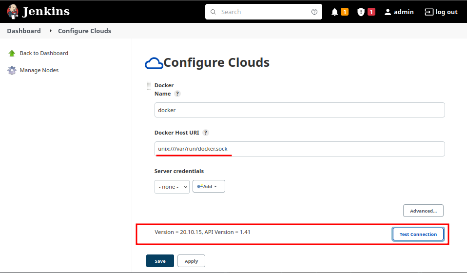
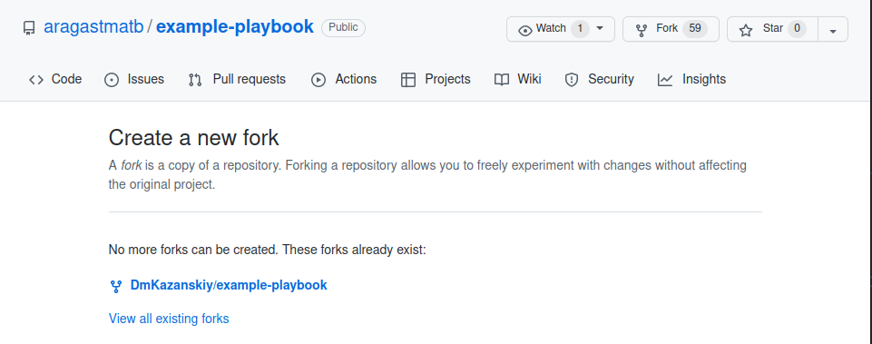
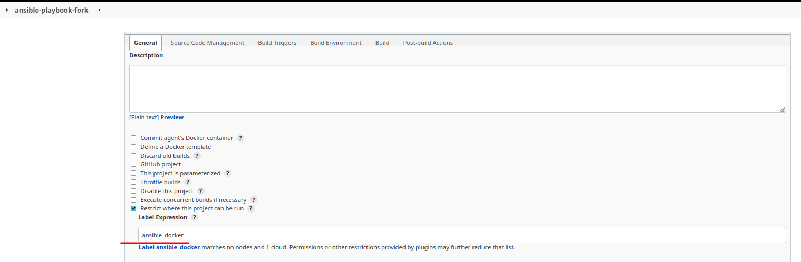
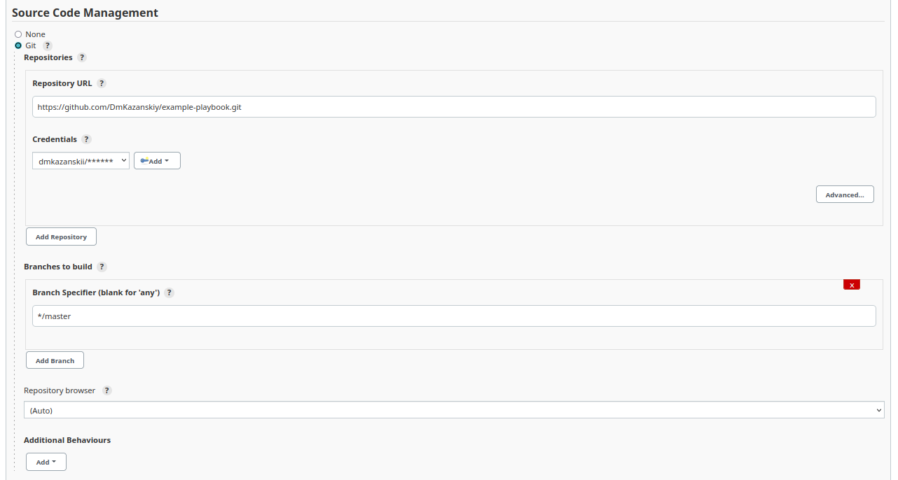
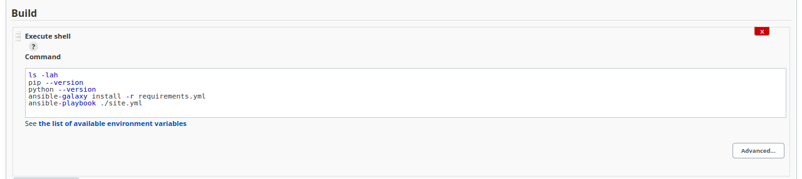
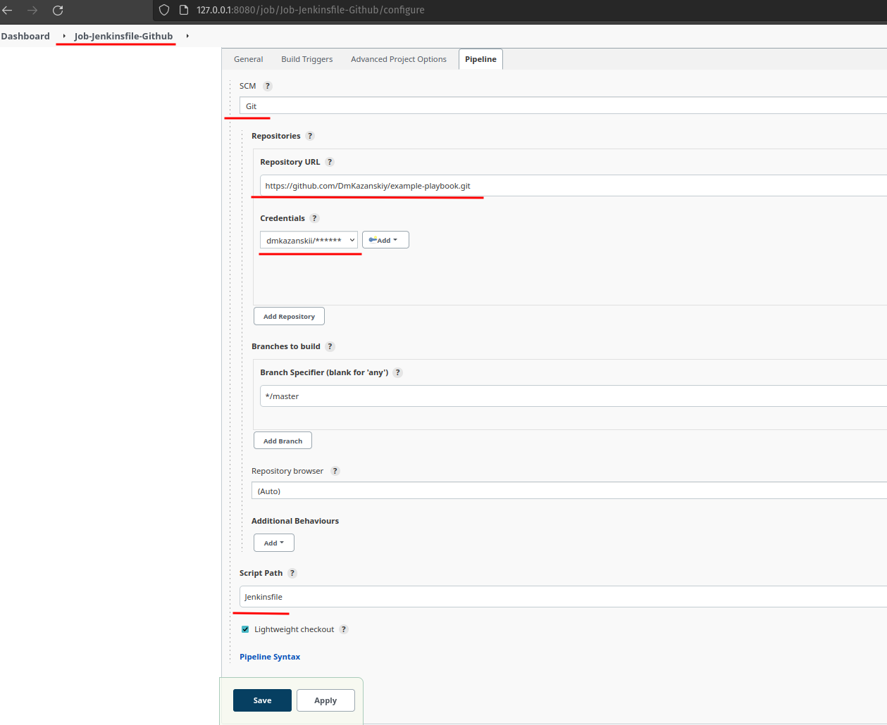
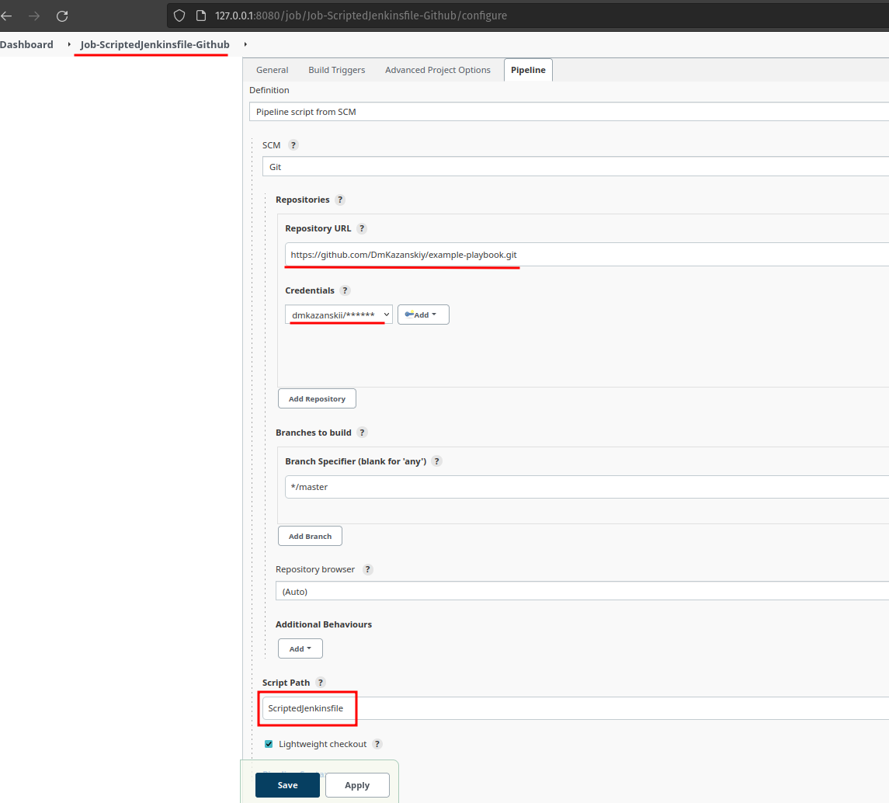

# Домашнее задание к занятию "09.03 Jenkins"

## Подготовка к выполнению

1. Установить jenkins по любой из [инструкций](https://www.jenkins.io/download/)

2. Запустить и проверить работоспособность
3. Сделать первоначальную настройку
4. Настроить под свои нужды
5. Поднять отдельный cloud

> 

6. Для динамических агентов можно использовать [образ](https://hub.docker.com/repository/docker/aragast/agent)
7. Обязательный параметр: поставить label для динамических агентов: `ansible_docker`

> 

8.  Сделать форк репозитория с [playbook](https://github.com/aragastmatb/example-playbook)

> 

## Основная часть

1. Сделать Freestyle Job, который будет запускать `ansible-playbook` из форка репозитория

> 
> 
> 

```bash
Started by user [admin](http://127.0.0.1:8080/user/admin)
Running as SYSTEM
Building remotely on [aragast-ansible-0003poa2a8kny on docker](http://127.0.0.1:8080/computer/aragast-ansible-0003poa2a8kny) (ansible_docker) in workspace /workspace/ansible-playbook-fork
Selected Git installation does not exist. Using Default
The recommended git tool is: NONE
using credential d9f89112-b158-45ac-a5e2-9a1041445308
Cloning the remote Git repository
Cloning repository [https://github.com/DmKazanskiy/example-playbook.git](https://github.com/DmKazanskiy/example-playbook.git)
 > git init /workspace/ansible-playbook-fork # timeout=10
Fetching upstream changes from [https://github.com/DmKazanskiy/example-playbook.git](https://github.com/DmKazanskiy/example-playbook.git)
 > git --version # timeout=10
 > git --version # 'git version 1.8.3.1'
using GIT_ASKPASS to set credentials 
 > git fetch --tags --progress [https://github.com/DmKazanskiy/example-playbook.git](https://github.com/DmKazanskiy/example-playbook.git) +refs/heads/*:refs/remotes/origin/* # timeout=10
 > git config remote.origin.url [https://github.com/DmKazanskiy/example-playbook.git](https://github.com/DmKazanskiy/example-playbook.git) # timeout=10
 > git config --add remote.origin.fetch +refs/heads/*:refs/remotes/origin/* # timeout=10
Avoid second fetch
 > git rev-parse refs/remotes/origin/master^{commit} # timeout=10
Checking out Revision 8f23bc42990207f22ed639b1e5dfdbd13ce102ed (refs/remotes/origin/master)
 > git config core.sparsecheckout # timeout=10
 > git checkout -f 8f23bc42990207f22ed639b1e5dfdbd13ce102ed # timeout=10
Commit message: "Create ScriptedJenkinsfile"
 > git rev-list --no-walk 49b4591a2fb218c2b293732853f701c92040cccb # timeout=10
[ansible-playbook-fork] $ /bin/sh -xe /tmp/jenkins6398093248397579459.sh
+ ls -lah
total 48K
drwxr-xr-x 4 root root 4.0K Jun 19 14:58 .
drwxr-xr-x 4 root root 4.0K Jun 19 14:58 ..
drwxr-xr-x 8 root root 4.0K Jun 19 14:58 .git
-rw-r--r-- 1 root root  204 Jun 19 14:58 Jenkinsfile
-rw-r--r-- 1 root root  505 Jun 19 14:58 ScriptedJenkinsfile
drwxr-xr-x 2 root root 4.0K Jun 19 14:58 inventory
-rw-r--r-- 1 root root  145 Jun 19 14:58 requirements.yml
-rw-r--r-- 1 root root  11K Jun 19 14:58 secret
-rwxr-xr-x 1 root root   65 Jun 19 14:58 site.yml
-rw-r--r-- 1 root root    8 Jun 19 14:58 vault_pass
+ pip --version
pip 21.0.1 from /usr/local/lib/python3.6/site-packages/pip (python 3.6)
+ python --version
Python 2.7.5
+ ansible-galaxy install -r requirements.yml
Starting galaxy role install process

- extracting java to /root/.ansible/roles/java
- java (1.0.1) was installed successfully
+ ansible-playbook ./site.yml
[WARNING]: No inventory was parsed, only implicit localhost is available
[WARNING]: provided hosts list is empty, only localhost is available. Note that
the implicit localhost does not match 'all'

PLAY [Install Java] ************************************************************
skipping: no hosts matched

PLAY RECAP *********************************************************************

Finished: SUCCESS
```

2. Сделать Declarative Pipeline, который будет выкачивать репозиторий с плейбукой и запускать её
3. Перенести Declarative Pipeline в репозиторий в файл `Jenkinsfile`
4. Перенастроить Job на использование `Jenkinsfile` из репозитория

> Подготовлен Pipeline 
> 
> 
> Результат выполнения ниже:

```bash
Started by user [admin](http://127.0.0.1:8080/user/admin)
Obtained Jenkinsfile from git [https://github.com/DmKazanskiy/example-playbook.git](https://github.com/DmKazanskiy/example-playbook.git)
[Pipeline] Start of Pipeline[](http://127.0.0.1:8080/job/Job-Jenkinsfile-Github/1/console#)
[Pipeline] node[](http://127.0.0.1:8080/job/Job-Jenkinsfile-Github/1/console#)
Running on [aragast-ansible-0003pax1udpss on docker](http://127.0.0.1:8080/computer/aragast%2Dansible%2D0003pax1udpss/) in /workspace/Job-Jenkinsfile-Github
[Pipeline] {[](http://127.0.0.1:8080/job/Job-Jenkinsfile-Github/1/console#)
[Pipeline] stage[](http://127.0.0.1:8080/job/Job-Jenkinsfile-Github/1/console#)
[Pipeline] { (Declarative: Checkout SCM)[](http://127.0.0.1:8080/job/Job-Jenkinsfile-Github/1/console#)
[Pipeline] checkout[](http://127.0.0.1:8080/job/Job-Jenkinsfile-Github/1/console#)
Selected Git installation does not exist. Using Default
The recommended git tool is: NONE
using credential d9f89112-b158-45ac-a5e2-9a1041445308
Cloning the remote Git repository
Cloning repository [https://github.com/DmKazanskiy/example-playbook.git](https://github.com/DmKazanskiy/example-playbook.git)
 > git init /workspace/Job-Jenkinsfile-Github # timeout=10
Fetching upstream changes from [https://github.com/DmKazanskiy/example-playbook.git](https://github.com/DmKazanskiy/example-playbook.git)
 > git --version # timeout=10
 > git --version # 'git version 1.8.3.1'
using GIT_ASKPASS to set credentials 
 > git fetch --tags --progress [https://github.com/DmKazanskiy/example-playbook.git](https://github.com/DmKazanskiy/example-playbook.git) +refs/heads/*:refs/remotes/origin/* # timeout=10
Avoid second fetch
Checking out Revision 49b4591a2fb218c2b293732853f701c92040cccb (refs/remotes/origin/master)
 > git config remote.origin.url [https://github.com/DmKazanskiy/example-playbook.git](https://github.com/DmKazanskiy/example-playbook.git) # timeout=10
 > git config --add remote.origin.fetch +refs/heads/*:refs/remotes/origin/* # timeout=10
 > git rev-parse refs/remotes/origin/master^{commit} # timeout=10
 > git config core.sparsecheckout # timeout=10
 > git checkout -f 49b4591a2fb218c2b293732853f701c92040cccb # timeout=10
Commit message: "Update requirements.yml"
First time build. Skipping changelog.
[Pipeline] }
[Pipeline] // stage
[Pipeline] withEnv[](http://127.0.0.1:8080/job/Job-Jenkinsfile-Github/1/console#)
[Pipeline] {[](http://127.0.0.1:8080/job/Job-Jenkinsfile-Github/1/console#)
[Pipeline] stage[](http://127.0.0.1:8080/job/Job-Jenkinsfile-Github/1/console#)
[Pipeline] { (First stage)[](http://127.0.0.1:8080/job/Job-Jenkinsfile-Github/1/console#)
[Pipeline] echo[](http://127.0.0.1:8080/job/Job-Jenkinsfile-Github/1/console#)
I'm runing
[Pipeline] }
[Pipeline] // stage
[Pipeline] stage[](http://127.0.0.1:8080/job/Job-Jenkinsfile-Github/1/console#)
[Pipeline] { (Second stage)[](http://127.0.0.1:8080/job/Job-Jenkinsfile-Github/1/console#)
[Pipeline] echo[](http://127.0.0.1:8080/job/Job-Jenkinsfile-Github/1/console#)
And I'm too
[Pipeline] }
[Pipeline] // stage
[Pipeline] }
[Pipeline] // withEnv
[Pipeline] }
[Pipeline] // node
[Pipeline] End of Pipeline
Finished: SUCCESS
```
5. Создать Scripted Pipeline, наполнить его скриптом из [pipeline](./pipeline)

6. Заменить credentialsId на свой собственный

```json
/*
replace with:
*/
stage("Git checkout"){
        git credentialsId: 'd9f89112-b158-45ac-a5e2-9a1041445308', url: 'https://github.com/DmKazanskiy/example-playbook.git'
    }
```

7. Проверить работоспособность, исправить ошибки, исправленный Pipeline вложить в репозитрий в файл `ScriptedJenkinsfile`

```json
/*
add step install requirements
*/
        if (secret_check){
            sh 'ansible-galaxy install -r requirements.yml'
            sh 'ansible-playbook site.yml -i inventory/prod.yml'
        }
```

> 
> 
>

```bash

tarted by user [admin](http://127.0.0.1:8080/user/admin)
Obtained ScriptedJenkinsfile from git [https://github.com/DmKazanskiy/example-playbook.git](https://github.com/DmKazanskiy/example-playbook.git)
[Pipeline] Start of Pipeline[](http://127.0.0.1:8080/job/Job-ScriptedJenkinsfile-Github/1/console#)
[Pipeline] node[](http://127.0.0.1:8080/job/Job-ScriptedJenkinsfile-Github/1/console#)
Running on [aragast-ansible-0003phnm34uc4 on docker](http://127.0.0.1:8080/computer/aragast%2Dansible%2D0003phnm34uc4/) in /workspace/Job-ScriptedJenkinsfile-Github
[Pipeline] {[](http://127.0.0.1:8080/job/Job-ScriptedJenkinsfile-Github/1/console#)
[Pipeline] stage[](http://127.0.0.1:8080/job/Job-ScriptedJenkinsfile-Github/1/console#)
[Pipeline] { (Git checkout)[](http://127.0.0.1:8080/job/Job-ScriptedJenkinsfile-Github/1/console#)
[Pipeline] git[](http://127.0.0.1:8080/job/Job-ScriptedJenkinsfile-Github/1/console#)
Selected Git installation does not exist. Using Default
The recommended git tool is: NONE
using credential d9f89112-b158-45ac-a5e2-9a1041445308
Cloning the remote Git repository
Cloning repository [https://github.com/DmKazanskiy/example-playbook.git](https://github.com/DmKazanskiy/example-playbook.git)
 > git init /workspace/Job-ScriptedJenkinsfile-Github # timeout=10
Fetching upstream changes from [https://github.com/DmKazanskiy/example-playbook.git](https://github.com/DmKazanskiy/example-playbook.git)
 > git --version # timeout=10
 > git --version # 'git version 1.8.3.1'
using GIT_ASKPASS to set credentials 
 > git fetch --tags --progress [https://github.com/DmKazanskiy/example-playbook.git](https://github.com/DmKazanskiy/example-playbook.git) +refs/heads/*:refs/remotes/origin/* # timeout=10
Avoid second fetch
Checking out Revision 8f23bc42990207f22ed639b1e5dfdbd13ce102ed (refs/remotes/origin/master)
 > git config remote.origin.url [https://github.com/DmKazanskiy/example-playbook.git](https://github.com/DmKazanskiy/example-playbook.git) # timeout=10
 > git config --add remote.origin.fetch +refs/heads/*:refs/remotes/origin/* # timeout=10
 > git rev-parse refs/remotes/origin/master^{commit} # timeout=10
 > git config core.sparsecheckout # timeout=10
 > git checkout -f 8f23bc42990207f22ed639b1e5dfdbd13ce102ed # timeout=10
 > git branch -a -v --no-abbrev # timeout=10
 > git checkout -b master 8f23bc42990207f22ed639b1e5dfdbd13ce102ed # timeout=10
Commit message: "Create ScriptedJenkinsfile"
First time build. Skipping changelog.
[Pipeline] }
[Pipeline] // stage
[Pipeline] stage[](http://127.0.0.1:8080/job/Job-ScriptedJenkinsfile-Github/1/console#)
[Pipeline] { (Check ssh key)[](http://127.0.0.1:8080/job/Job-ScriptedJenkinsfile-Github/1/console#)
[Pipeline] }
[Pipeline] // stage
[Pipeline] stage[](http://127.0.0.1:8080/job/Job-ScriptedJenkinsfile-Github/1/console#)
[Pipeline] { (Run playbook)[](http://127.0.0.1:8080/job/Job-ScriptedJenkinsfile-Github/1/console#)
[Pipeline] sh[](http://127.0.0.1:8080/job/Job-ScriptedJenkinsfile-Github/1/console#)
+ ansible-galaxy install -r requirements.yml
Starting galaxy role install process
- extracting java to /root/.ansible/roles/java
- java (1.0.1) was installed successfully
[Pipeline] sh[](http://127.0.0.1:8080/job/Job-ScriptedJenkinsfile-Github/1/console#)
+ ansible-playbook site.yml -i inventory/prod.yml

PLAY [Install Java] ************************************************************
TASK [Gathering Facts] *********************************************************
ok: [localhost]
TASK [java : Upload .tar.gz file containing binaries from local storage] *******
skipping: [localhost]
TASK [java : Upload .tar.gz file conaining binaries from remote storage] *******
changed: [localhost]
TASK [java : Ensure installation dir exists] ***********************************
changed: [localhost]
TASK [java : Extract java in the installation directory] ***********************
changed: [localhost]
TASK [java : Export environment variables] *************************************
changed: [localhost]
PLAY RECAP *********************************************************************
localhost                  : ok=5    changed=4    unreachable=0    failed=0    skipped=1    rescued=0    ignored=0   

[Pipeline] }
[Pipeline] // stage
[Pipeline] }
[Pipeline] // node
[Pipeline] End of Pipeline
Finished: SUCCESS```

8. Отправить ссылку на репозиторий в ответе

> [Ссылка на репозиторий](https://github.com/DmKazanskiy/example-playbook)


## Необязательная часть

1. Создать скрипт на groovy, который будет собирать все Job, которые завершились хотя бы раз неуспешно. Добавить скрипт в репозиторий с решеним с названием `AllJobFailure.groovy`
2. Установить customtools plugin
3. Поднять инстанс с локальным nexus, выложить туда в анонимный доступ  .tar.gz с `ansible`  версии 2.9.x
4. Создать джобу, которая будет использовать `ansible` из `customtool`
5. Джоба должна просто исполнять команду `ansible --version`, в ответ прислать лог исполнения джобы 

---

### Как оформить ДЗ?

Выполненное домашнее задание пришлите ссылкой на .md-файл в вашем репозитории.

---
