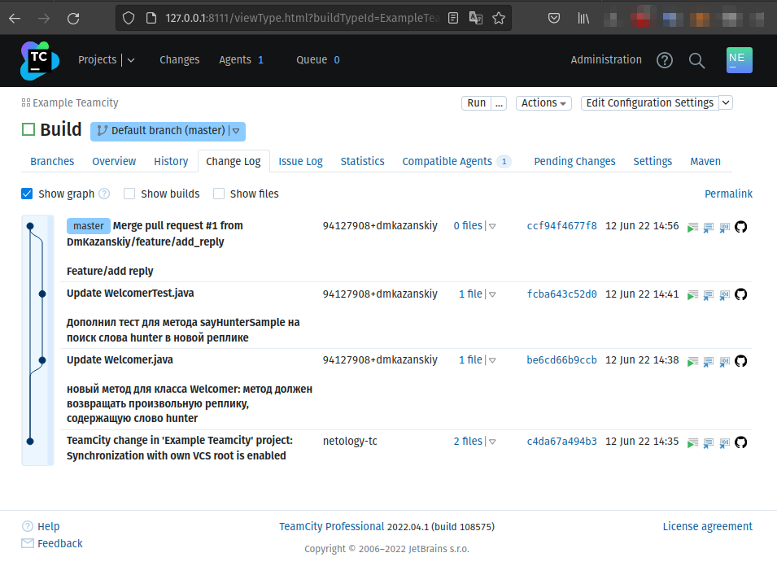
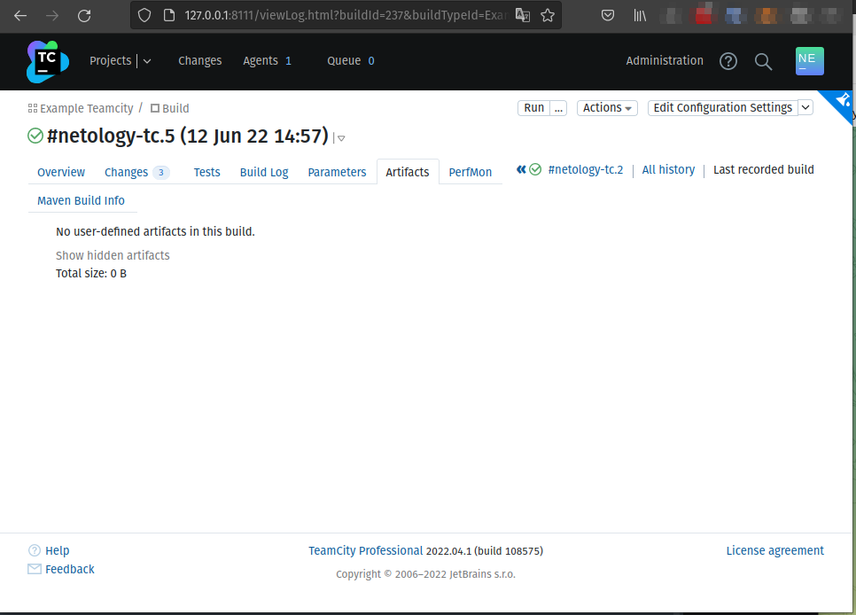
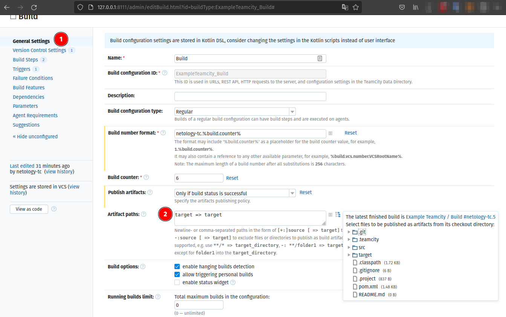
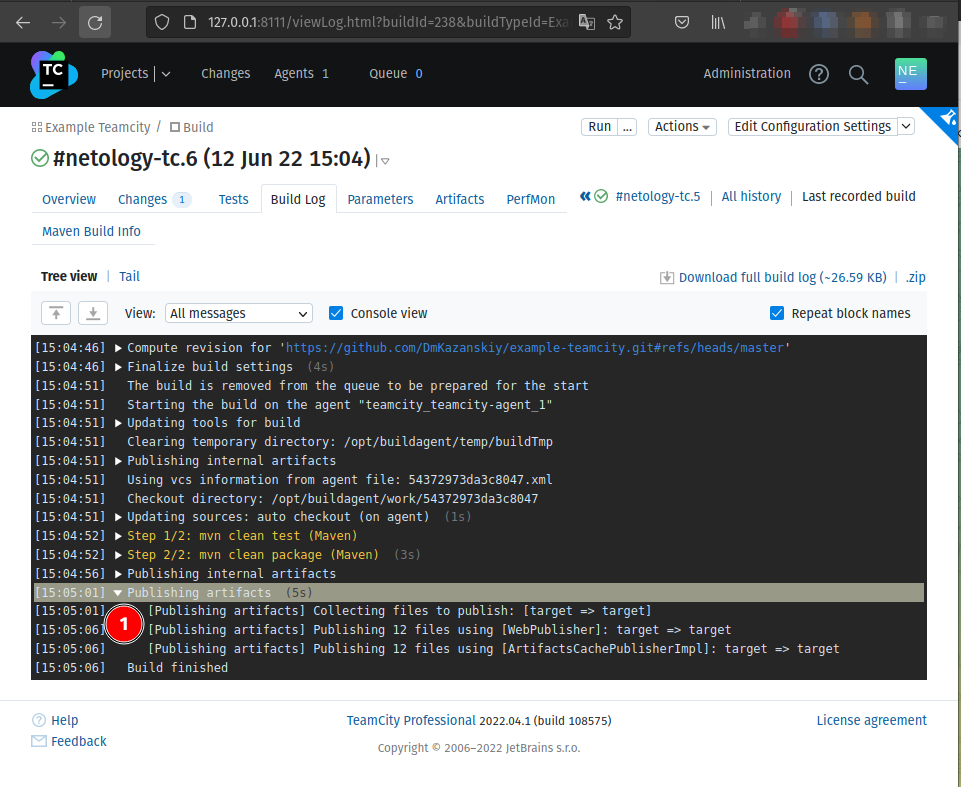
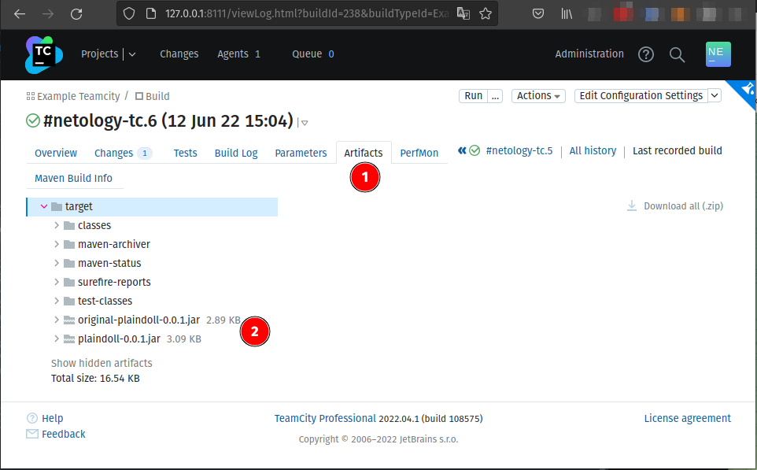

# Домашнее задание к занятию "09.04 Teamcity"

## Подготовка к выполнению

1. Поднимите инфраструктуру [teamcity](./teamcity/docker-compose.yml)

```bash
mnt-homeworks/09-ci-04-teamcity/teamcity$ docker-compose up
...
teamcity_1        | =======================================================================
teamcity_1        | TeamCity initialized, server UUID: 6a3bafa0-106a-4183-bb75-a0170ed605dc, URL: http://127.0.0.1:8111
teamcity_1        | TeamCity is running in professional mode
teamcity_1        | [TeamCity] Super user authentication token: 2085054829451824564 (use empty username with the token as the password to access the server)
.....
```

2. Если хочется, можете создать свою собственную инфраструктуру на основе той технологии, которая нравится. Инструкция по установке из [документации](https://www.jetbrains.com/help/teamcity/installing-and-configuring-the-teamcity-server.html)
3. Дождитесь запуска teamcity, выполните первоначальную настройку
4. Авторизуйте агент
5. Сделайте fork [репозитория](https://github.com/aragastmatb/example-teamcity)

## Основная часть

1. Создайте новый проект в teamcity на основе fork
2. Сделайте autodetect конфигурации
3. Сохраните необходимые шаги, запустите первую сборку master'a
4. Поменяйте условия сборки: если сборка по ветке `master`, то должен происходит `mvn clean package`, иначе `mvn clean test`


5. Мигрируйте `build configuration` в репозиторий

6. Создайте отдельную ветку `feature/add_reply` в репозитории
7. Напишите новый метод для класса Welcomer: метод должен возвращать произвольную реплику, содержащую слово `hunter`
8. Дополните тест для нового метода на поиск слова `hunter` в новой реплике
9. Сделайте push всех изменений в новую ветку в репозиторий
10. Убедитесь что сборка самостоятельно запустилась, тесты прошли успешно
```bash
[14:40:13]__[Step 1/2]_ -------------------------------------------------------_
[14:40:13]__[Step 1/2]_ T E S T S_
[14:40:13]__[Step 1/2]_ -------------------------------------------------------_
[14:40:13]__[Step 1/2]_ Running plaindoll.WelcomerTest_
[14:40:13]__[Step 1/2]_ Tests run: 4, Failures: 0, Errors: 0, Skipped: 0, Time elapsed: 0.03 sec_
[14:40:13]__[Step 1/2]__
[14:40:13]__[Step 1/2]_ Results :_
[14:40:13]__[Step 1/2]__
[14:40:13]__[Step 1/2]_ Tests run: 4, Failures: 0, Errors: 0, Skipped: 0_
[14:40:13]__[Step 1/2]__
[14:40:13]__[Step 1/2]_ [INFO] ------------------------------------------------_
[14:40:13]__[Step 1/2]_ [INFO] BUILD SUCCESS_
[14:40:13]__[Step 1/2]_ [INFO] ------------------------------------------------_
[14:40:13]__[Step 1/2]_ [INFO] Total time: 1.022 s_
[14:40:13]__[Step 1/2]_ [INFO] Finished at: 2022-06-12T15:40:13+01:00_
[14:40:13]__[Step 1/2]_ [INFO] ------------------------------------------------_
[14:40:13]__[Step 1/2]_ Process exited with code 0_
```

11. Внесите изменения из произвольной ветки `feature/add_reply` в `master` через `Merge`



12. Убедитесь, что нет собранного артефакта в сборке по ветке `master`



13. Настройте конфигурацию так, чтобы она собирала `.jar` в артефакты сборки



14. Проведите повторную сборку мастера, убедитесь, что сбора прошла успешно и артефакты собраны





15. Проверьте, что конфигурация в репозитории содержит все настройки конфигурации из teamcity
16. В ответ предоставьте ссылку на репозиторий


---

### Как оформить ДЗ?

Выполненное домашнее задание пришлите ссылкой на .md-файл в вашем репозитории.

---
