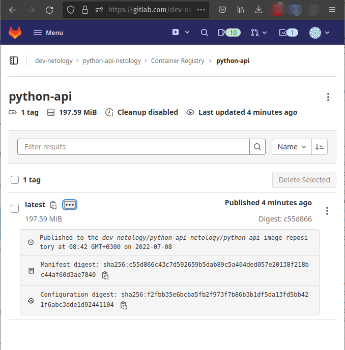
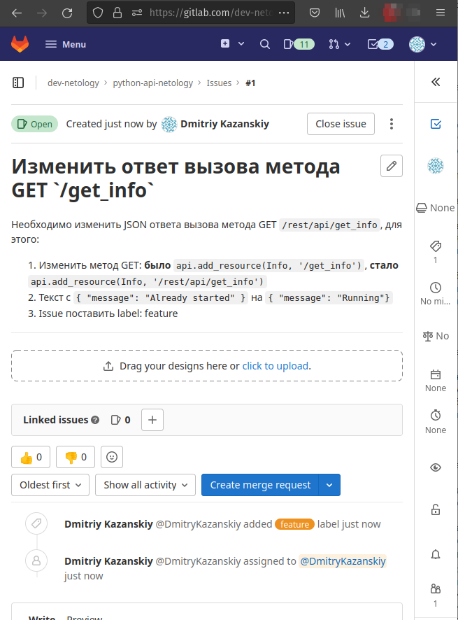

# Домашнее задание к занятию "09.05 Gitlab"

# python-api-netology  
  
Домашнее задание к занятию "09.05 Gitlab  
  
# Домашнее задание к занятию "09.05 Gitlab"  
  
## Подготовка к выполнению  
  
1. Необходимо [зарегистрироваться](https://about.gitlab.com/free-trial/)  
2. Создайте свой новый проект - `python-api-netology`  
3. Создайте новый репозиторий в gitlab, наполните его [файлами](./repository) - **Ok**  
4. Проект должен быть публичным, остальные настройки по желанию - `public`  

> 
> [Ссылка на проект с выполненным д.з.](https://gitlab.com/dev-netology/python-api-netology/-/tree/main)  
>
## Основная часть  
  
### DevOps  
  
В репозитории содержится код проекта на python. Проект - RESTful API сервис. Ваша задача автоматизировать сборку образа с выполнением python-скрипта:  
1. Образ собирается на основе [centos:7](https://hub.docker.com/_/centos?tab=tags&page=1&ordering=last_updated)  
2. Python версии не ниже 3.7  
3. Установлены зависимости: `flask` `flask-jsonpify` `flask-restful`  
4. Создана директория `/python_api`  
5. Скрипт из репозитория размещён в /python_api  
6. Точка вызова: запуск скрипта  
7. Если сборка происходит на ветке `master`: Образ должен пушится в docker registry вашего gitlab `python-api:latest`, иначе этот шаг нужно пропустить  
  
```bash  
...  

$ uname -aLinux runner-j2nyww-s-project-37684823-concurrent-0 5.4.109+ #1 SMP Wed Jun 16 20:00:10 PDT 2021 x86_64 Linux$ echo $CI_REGISTRY_USERgitlab-ci-token  
$ echo $CI_REGISTRY_IMAGEregistry.gitlab.com/dev-netology/python-api-netology  
$ echo $CI_COMMIT_TIMESTAMP2022-07-08T20:39:49+03:00  
$ echo $CI_COMMIT_SHA0d166ff2c96d9de3cc900a403d2109052c25fc55  
$ echo $CI_COMMIT_REF_NAMEmain  
$ echo -n $CI_REGISTRY_PASSWORD | docker login -u $CI_REGISTRY_USER --password-stdin $CI_REGISTRYWARNING! Your password will be stored unencrypted in /root/.docker/config.json.Configure a credential helper to remove this warning. Seehttps://docs.docker.com/engine/reference/commandline/login/#credentials-store  
Login Succeeded
$ docker build -t $CI_REGISTRY_IMAGE/$NET_NAME:latest .
Step 1/5 : FROM centos:77: Pulling from library/centos
2d473b07cdd5: Pulling fs layer...  
...  
Successfully built f2fbb35e6bcbSuccessfully tagged registry.gitlab.com/dev-netology/python-api-netology/python-api:latest
$ docker push $CI_REGISTRY_IMAGE/$NET_NAME:latest
The push refers to repository [registry.gitlab.com/dev-netology/python-api-netology/python-api]
a449ee3c858c: Preparing
d5b877d26683: Preparing
d6db22f5c385: Preparing
174f56854903: Preparing
a449ee3c858c: Pushed
d5b877d26683: Pushed
174f56854903: Pushed
d6db22f5c385: Pushed
latest: digest: sha256:c55d866c43c7d592659b5dab89c5a404ded057e20138f218bc44af60d3ae7840 
size: 1160
Cleaning up project directory and file based variablesJob succeeded

```  
  
  
### Product Owner  
  
Вашему проекту нужна бизнесовая доработка: необходимо поменять JSON ответа на вызов метода GET `/rest/api/get_info`, необходимо создать Issue в котором указать:  
1. Какой метод необходимо исправить  
2. Текст с `{ "message": "Already started" }` на `{ "message": "Running"}`  
3. Issue поставить label: feature  
  
  
  
### Developer  
  
Вам пришел новый Issue на доработку, вам необходимо:  
1. Создать отдельную ветку, связанную с этим issue  
2. Внести изменения по тексту из задания  
3. Подготовить Merge Requst, влить необходимые изменения в `master`, проверить, что сборка прошла успешно  
  
  
### Tester  
  
Разработчики выполнили новый Issue, необходимо проверить валидность изменений:  
1. Поднять докер-контейнер с образом `python-api:latest` и проверить возврат метода на корректность  
2. Закрыть Issue с комментарием об успешности прохождения, указав желаемый результат и фактически достигнутый  
  
```bash  
...  
$ uname -aLinux runner-xxurkrix-project-37684823-concurrent-0 5.4.109+ #1 SMP Wed Jun 16 20:00:10 PDT 2021 x86_64 Linux$ echo $CI_REGISTRY_USERgitlab-ci-token  
$ echo $CI_REGISTRY_IMAGEregistry.gitlab.com/dev-netology/python-api-netology  
$ echo $CI_COMMIT_TIMESTAMP2022-07-08T19:24:08+00:00  
$ echo $CI_COMMIT_SHA8bf77cf5392c947707db3b0dd11c128a1e0b8c7d  
$ echo $CI_COMMIT_REF_NAMEmain  
$ echo -n $CI_REGISTRY_PASSWORD | docker login -u $CI_REGISTRY_USER --password-stdin $CI_REGISTRY...  
Successfully built 3fb20f74bff7
Successfully tagged registry.gitlab.com/dev-netology/python-api-netology/python-api:latest
$ docker push $CI_REGISTRY_IMAGE/$NET_NAME:latestThe push refers to repository [registry.gitlab.com/dev-netology/python-api-netology/python-api]
c1c85d937d7d: Preparing
c8f79cc0e21f: Preparing
9a37786f59dd: Preparing
174f56854903: Preparing
174f56854903: Layer already exists
c1c85d937d7d: Pushed
c8f79cc0e21f: Pushed
9a37786f59dd: Pushed
latest: digest: sha256:608b5417743f0d598e136f1e8c16ac7773c040d80caa2cdaa4cf45ffba41c96a 
size: 1160
Cleaning up project directory and file based variables 
00:00Job succeeded

```  
  
## Итог  
  
После успешного прохождения всех ролей - отправьте ссылку на ваш проект в гитлаб, как решение домашнего задания  - [Ссылка на выполненное д.з.](https://gitlab.com/dev-netology/python-api-netology/-/tree/main) 
  
## Необязательная часть  
  
Автомазируйте работу тестировщика, пусть у вас будет отдельный конвейер, который автоматически поднимает контейнер и выполняет проверку, например, при помощи curl. На основе вывода - будет приниматься решение об успешности прохождения тестирования  
  
В файле `.gitlab-ci.yml` stage "test" со следующим содержимым:  
  
```bash  
...  
variables:  
  NET_NAME: "python-api"...  
test:  
  stage: test  needs: ["build&deploy"]  script:  
    - docker pull $CI_REGISTRY_IMAGE/$NET_NAME    - docker run -d -p 5290:5290 --name python-api $CI_REGISTRY_IMAGE/$NET_NAME:latest sleep 40    - docker ps -a    - sleep 15    - docker exec $NET_NAME curl -s http://0.0.0.0:5290/rest/api/get_info | grep "Running"  only:  
    - main```  
  
---  
  
### Как оформить ДЗ?  
  
Выполненное домашнее задание пришлите ссылкой на .md-файл в вашем репозитории.  
  
---